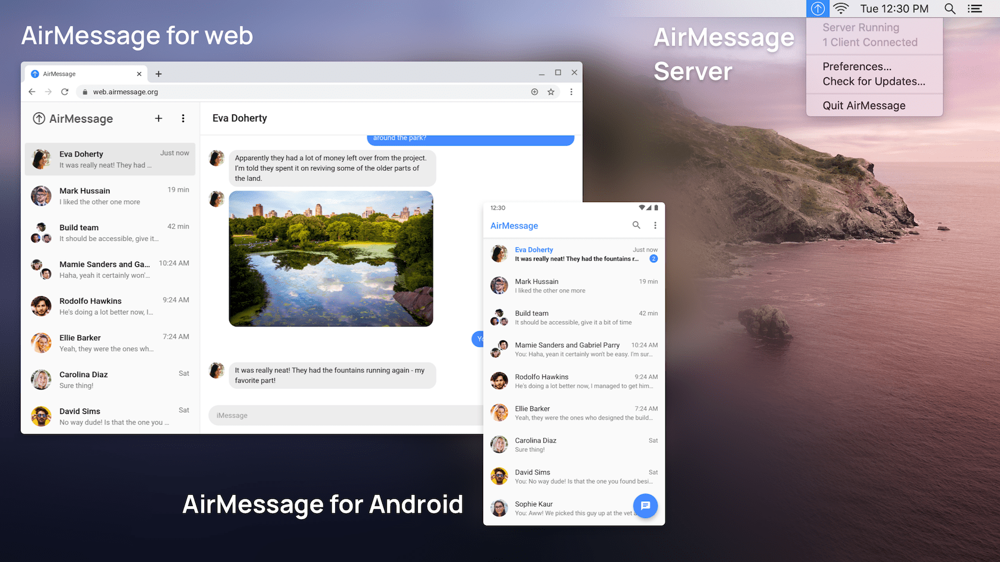

# AirMessage Server

#### This version of AirMessage Server is no longer maintained. Please see [airmessage/airmessage-server](https://github.com/airmessage/airmessage-server), which runs as a native macOS app.

AirMessage lets people use iMessage on the devices they like.
**AirMessage Server** functions as the bridge between AirMessage client apps and iMessage by running as a service on a Mac computer.

Other AirMessage repositories:
[Android](https://github.com/airmessage/airmessage-android) |
[Web](https://github.com/airmessage/airmessage-web) |
[Connect (community)](https://github.com/airmessage/airmessage-connect-java)

## Getting started

To build AirMessage Server, you will need [version 14+ of the JDK](https://adoptopenjdk.net), as well as [Node.js](https://nodejs.org).

AirMessage Server uses Java, [jOOQ](https://www.jooq.org) (for database interactions), [SWT](https://www.eclipse.org/swt) (for UI), and [Gradle](https://gradle.org) (for builds).

AirMessage Server uses a configuration file to associate with online services like Firebase and Sentry.
The app will not build without valid configuration files, so to get started quickly, you can copy the provided default files to use a pre-configured Firebase project, or you may provide your own Firebase configuration file:
- `connectauth/secrets.default.json` > `connectauth/secrets.json`
- `src/main/resources/secrets.default.properties` > `src/main/resources/secrets.properties`
- `src/main/resources/sentry.default.properties` > `src/main/resources/sentry.properties` (no-op)

AirMessage Server uses a combination of Gradle and a shell script to build the app (if someone is more experienced with Gradle, I'd love to move the build to be Gradle-only!) To run the app, run `./gradlew run`. To package the app, run `./buildAndSign.sh`.

Please note that the authentication screen for signing in to AirMessage Connect will likely not work unless the app is packaged due to Apple's App Transport Security restrictions.
  
### Building a signed app
To create a signed app, run `buildAndSign.sh [signing identity] [account username] [account password] [team short name]`.

The command requires 4 arguments in order to be able to properly codesign and notarize the app:
- `[signing identity]`: Used with the [`codesign`][codesign] command. Run `security find-identity -v -p codesigning` to list codesign identities. Provide the full string value of the identity, like `Developer ID Application: John Doe (DUCNFCN445)`.
- `[account username]`: Used with [`altool`][altool]. The email address of an Apple ID with access to App Store Connect.
- `[account password]`: Used with [`altool`][altool]. An [app-specific password](https://support.apple.com/en-us/HT204397) for the Apple ID.
  Either the name of the Keychain entry of the password in the format of `@keychain:ENTRY_NAME`, or in plaintext (not recommended).
- `[team short name]`: Used with [`altool`][altool]. The short name of the team to use for signing. Run `xcrun altool --list-providers -u "AC_USERNAME" -p "@keychain:ENTRY_NAME"` to list providers.

[codesign]: https://developer.apple.com/library/archive/documentation/Security/Conceptual/CodeSigningGuide/Procedures/Procedures.html
[altool]: https://developer.apple.com/documentation/xcode/notarizing_macos_software_before_distribution/customizing_the_notarization_workflow

## File structure outline

- `/src` holds the regular Java source code and resources.
- `/connectauth` holds a webpack page that is used for Firebase Authentication.

## Building and running for AirMessage Connect

In order to help developers get started quickly, we host a separate open-source version of AirMessage Connect at `connect-open.airmessage.org`.
The default configuration is pre-configured to authenticate and connect to this server.
Since this version of AirMessage Connect is hosted in a separate environment from official servers, you will have to connect client apps to the same AirMessage Connect server.

We kindly ask that you do not use AirMessage's official Connect servers with any unofficial builds of AirMessage-compatible software.

---

Thank you for your interest in contributing to AirMessage!
You're helping to shape the future of an open, secure messaging market.
Should you have any questions, comments, or concerns, please shoot an email to [hello@airmessage.org](mailto:hello@airmessage.org).
